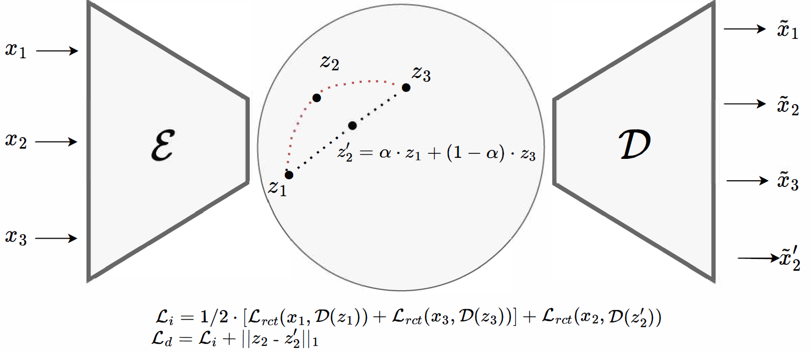
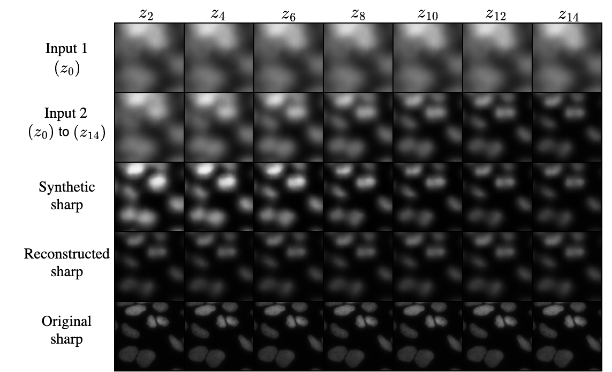

### Official website of 'Defocus Blur Synthesis and Deblurring via Interpolation and Extrapolation in Latent Space (Accepted at CAIP2023)'

Paper can be [found](https://link.springer.com/chapter/10.1007/978-3-031-44240-7_20) here.

#### Introduction
We propose a method that can deblur images as well as synthesize defocus blur. We train autoencoders with implicit and explicit regularization techniques to enforce
linearity relations among the representations of different blur levels in the latent space. This allows for the exploration of different blur levels of an
object by linearly interpolating/extrapolating the latent representations of images taken at different focal planes. Compared to existing works, we use a simple architecture to synthesize images with flexible blur levels, leveraging the linear latent space. Our regularized autoencoders can effectively mimic blur and deblur, increasing data variety as a data augmentation technique and improving the quality of microscopic images, which would be beneficial for further processing and analysis. 

<p align="center"></p>

Examples of deblurred images:


#### Installation 
* Installation
  * Clone this repository:
    * ```git clone https://github.com/nis-research/linear-latent-blur.git```
  * Install the required libraries:
    * ```conda create -n defocus_blur_venv python=3.10 anaconda```, then ```conda env update --name defocus_blur_venv --file environment.yml --prune```
* [Dataset](https://bbbc.broadinstitute.org/BBBC006)
  * The images from each z-stack level must be inside a directory named `z` and the digit/number representing the level (i.e. `z0` for images with z-stack 0). All these directories must be contained within a directory named `all`. An example is shown in the tree-structure below.
  * To process the images for usage and split them in train-validation-test sets, some configuration settings have to be made. Go to the `config.py` file in the `models` directory and set the `TEST_RATIO` and `VALIDATION_RATIO` variables. The remaining ratio of images will be used for the training set. Also set the `STACKS` variable accordingly. It describes which z-stack levels will be used throughout the program. In the `prepare_data.py` script, set the `triplets_train` variable accordingly.
  * To prepare the train-val-test sets, run the following command:
     ```
     python prepare_data.py
    ```
    Three `train`, `test`, and `val` directories will be created, with the hierarchy shown in the tree-structure below.
    
    ```.
    +-- dataset
    |   +-- dataset.py
    |   +-- prepare_data.py
    |   +-- all
    |   |   +-- z0
    |   |   +-- z1
    |   |   ....
    |   |   +-- z33
    |   +-- test
    |   |   +-- raw
    |   |   |   +-- z0
    |   |   |   ....
    |   |   |   +-- z33
    |   |   +-- processed
    |   |   |   +-- z0
    |   |   |   ....
    |   |   |   +-- z33
    |   +-- train
    |   |   +-- raw
    |   |   +-- processed
    |   +-- val
    |   |   +-- raw
    |   |   +-- processed
    +-- models
    |   +-- metrics.py
    |   +-- model.py
    |   +-- test.py
    |   +-- utils.py
    |   +-- visualizations.py
    +-- requirements.txt
    ```
    * Other configurations can be set from the `config.py` file. Modify them accordingly before running the experiments.
* Train models
  * Run the command
    ```
    python model.py -experiment "some-name" [--model-type "some_type"] [--slide-type "some_type"] [--input-path "some/path/"]
    ```
    Replace the contents of the quotes accordingly. The arguments between `[]` are optional. Model type and slide type default to `baseline` and `w1`. Input path is only required if the input images are not in the `/dataset` directory of the project.
    Also, set the `LAYERS_DEPTH` variable in the `config.py` file accordingly.
* Test models
  * Run the command
  ```
  pytohn test.py -experiment "some_name" [--slide-type "some_type"] [--model-type "some_type"] [-vnum 0] [-epoch 0] [-step 0] [--input-path "some/path/"] [--output-path "some/path/"]

  ```
  Replace the arguments accordingly. The arguments between `[]` are optional. Model type and slide type default to `baseline` and `w1`. The `vnum`, `epoch` and `step` arguments must only be provided the first time when an experiment is tested. Input path is only required if the input images are not in the `/dataset` directory of the project. Check `test.py` for more information on how the code can be used to test various properties of the models / generate visualizations.

## Citation

```
@misc{
}
```

